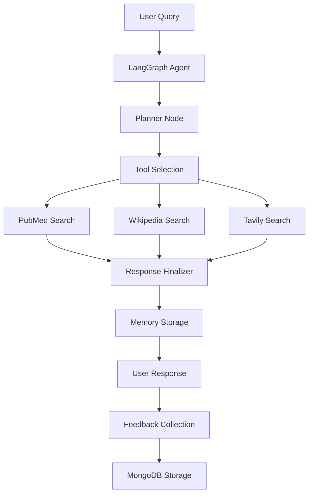

# 🩺 MedAssist AI

<div align="center">


[](https://github.com/HemanthReddy-1408/medassist-ai/stargazers)

**An intelligent, multi-tool medical assistant built using LangGraph, LangChain, and Groq**

*Leverages RAG, memory, and human-in-the-loop feedback for safe and insightful responses to medical queries*

[Features](#-features) • [Installation](#-installation) • [Usage](#-usage) • [API](#-api) • [Contributing](#-contributing)

</div>

---

## 🌟 Overview

MedAssist AI is a sophisticated healthcare assistant that combines the power of:
- **🧠 Agentic AI** with LangGraph workflow orchestration
- **🔍 Multi-source RAG** for evidence-based responses
- **💾 Persistent memory** for contextual conversations
- **🔐 Secure authentication** with JWT tokens
- **💬 Interactive feedback** system for continuous improvement

> **⚠️ Important Disclaimer:** MedAssist AI is an experimental system designed for educational and research purposes. It is **not a substitute** for professional medical advice, diagnosis, or treatment. Always consult qualified healthcare professionals for medical concerns.

---

## 🏗️ System Architecture



---

## ✨ Features

### Core Capabilities
- 🧠 **Agentic LangGraph Flow** - Intelligent planning, tool execution, and response finalization
- 🔍 **Multi-source RAG** - Retrieval from PubMed, Wikipedia, and Tavily for comprehensive answers
- 🧵 **Session-based Memory** - Persistent conversation context using `thread_id` and MongoDB
- 💬 **Feedback System** - Like/dislike ratings with optional comments for model improvement
- 🔐 **JWT Authentication** - Secure login and access control
- 📊 **Real-time UI** - Interactive Streamlit interface for seamless user experience
- 🗂️ **RESTful API** - FastAPI backend for easy integration

### Technical Features
- **Groq-powered LLM** - Fast inference with Gemma-2B model
- **MongoDB Integration** - Scalable document storage for memory and feedback
- **Modular Architecture** - Clean separation of concerns for maintainability
- **Error Handling** - Robust error management and logging
- **Responsive Design** - Mobile-friendly Streamlit interface

---

## 🚀 Installation

### Prerequisites
- Python 3.8 or higher
- MongoDB instance (local or cloud)
- API keys for Groq and Tavily

### Quick Setup

```bash
# 1. Clone the repository
git clone https://github.com/HemanthReddy-1408/medassist-ai.git
cd medassist-ai

# 2. Create virtual environment
python -m venv venv
source venv/bin/activate  # On Windows: venv\Scripts\activate

# 3. Install dependencies
pip install -r requirements.txt

# 4. Configure environment variables
cp .env.example .env
```

### Environment Configuration

Edit `.env` file with your credentials:

```env
# LLM Configuration
GROQ_API_KEY=your_groq_api_key_here

# Database
MONGODB_URI=mongodb://localhost:27017/medassist

# Authentication
JWT_SECRET=your_super_secure_jwt_secret_key

# Search APIs
TAVILY_API_KEY=your_tavily_api_key_here

# Optional: Logging
LOG_LEVEL=INFO
```

### Running the Application

```bash
# Terminal 1: Start FastAPI backend
uvicorn backend.main:app --reload --host 0.0.0.0 --port 8000

# Terminal 2: Start Streamlit frontend
streamlit run streamlit_ui/app.py --server.port 8501
```

The application will be available at:
- **Frontend**: http://localhost:8501
- **Backend API**: http://localhost:8000
- **API Documentation**: http://localhost:8000/docs

---

## 📁 Project Structure

```
medassist-ai/
│
├── 📁 app/                    # LangGraph agent logic
│   ├── 📁 agent/
│   │   ├── graph.py          # LangGraph workflow builder
│   │   ├── state.py          # State schema definitions
│   │   └── 📁 nodes/         # Individual workflow nodes
│   │       ├── planner.py    # Query planning logic
│   │       ├── tools.py      # RAG tool implementations
│   │       └── finalizer.py  # Response finalization
│   └── llm.py                # Groq LLM configuration
│
├── 📁 backend/               # FastAPI backend
│   ├── 📁 api/
│   │   ├── routes.py         # API endpoints
│   │   └── auth.py           # JWT authentication
│   ├── 📁 db/
│   │   ├── models.py         # Database models
│   │   └── mongo_client.py   # MongoDB connector
│   └── main.py               # FastAPI application
│
├── 📁 streamlit_ui/          # Streamlit frontend
│   ├── app.py                # Main application
│   ├── chat.py               # Chat interface
│   ├── auth.py               # Authentication UI
│   └── feedback.py           # Feedback forms
│
├── 📁 outputs/               # Generated artifacts
│   └── 📁 graph/             # System architecture diagrams
│
├── 📁 data/                  # Sample data and logs
├── 📁 whisper_stt/           # Voice input (planned)
├── 📄 requirements.txt       # Python dependencies
├── 📄 .env.example          # Environment template
└── 📄 README.md             # This file
```

---

## 🔧 Tech Stack

| **Layer**     | **Technology**                               | **Purpose**                    |
|---------------|---------------------------------------------|--------------------------------|
| **Agent**     | LangGraph + LangChain                       | Workflow orchestration         |
| **LLM**       | Gemma-2B via Groq API                      | Fast language processing       |
| **RAG**       | PubMed, Wikipedia, Tavily Search           | Knowledge retrieval            |
| **Frontend**  | Streamlit                                   | Interactive user interface     |
| **Backend**   | FastAPI + JWT                               | API and authentication         |
| **Database**  | MongoDB                                     | Memory and feedback storage    |
| **Deployment** | Docker, Render, Railway (planned)          | Cloud deployment               |

---

## 💡 Usage

### Basic Query Flow

1. **Authentication**: Sign up or log in through the Streamlit interface
2. **Ask Questions**: Submit medical queries in natural language
3. **Get Responses**: Receive evidence-based answers with source citations
4. **Provide Feedback**: Rate responses and provide optional comments
5. **Review History**: Access previous conversations and responses

### Example Interaction

```
🧑 User: "I've been feeling tired even after sleeping, get headaches often, 
         look pale, and feel breathless climbing stairs. What could be the reason?"

🤖 MedAssist AI: "Based on your symptoms (fatigue, headaches, pallor, and 
                  shortness of breath), this could indicate iron deficiency anemia. 
                  These symptoms are commonly associated with reduced oxygen-carrying 
                  capacity in your blood.
                  
                  I recommend:
                  • Getting a Complete Blood Count (CBC) test
                  • Checking iron levels and ferritin
                  • Consulting with a healthcare professional for proper diagnosis
                  
                  Please see a doctor for proper evaluation and treatment."
```

### API Usage

```python
import requests

# Authentication
auth_response = requests.post("http://localhost:8000/auth/login", json={
    "email": "user@example.com",
    "password": "your_password"
})
token = auth_response.json()["access_token"]

# Query the medical assistant
headers = {"Authorization": f"Bearer {token}"}
response = requests.post("http://localhost:8000/api/query", 
                        headers=headers,
                        json={"query": "What are the symptoms of diabetes?"})

print(response.json())
```

---

## 🔐 Authentication & Security

### JWT-based Authentication
- **Secure token generation** with configurable expiration
- **Route protection** for sensitive endpoints
- **User session management** with refresh tokens

### Security Features
- **Password hashing** with bcrypt
- **Input validation** and sanitization
- **Rate limiting** for API endpoints
- **CORS configuration** for cross-origin requests

### Protected Routes
- `/api/query` - Submit medical queries
- `/api/feedback` - Provide response feedback
- `/api/history` - Access conversation history
- `/api/profile` - User profile management

---

## 📊 API Documentation

### Authentication Endpoints

#### POST `/auth/register`
Register a new user account.

```json
{
  "email": "user@example.com",
  "password": "secure_password",
  "full_name": "John Doe"
}
```

#### POST `/auth/login`
Authenticate user and receive JWT token.

```json
{
  "email": "user@example.com",
  "password": "secure_password"
}
```

### Query Endpoints

#### POST `/api/query`
Submit a medical query to the assistant.

```json
{
  "query": "What are the symptoms of hypertension?",
  "thread_id": "optional_session_id"
}
```

#### GET `/api/history`
Retrieve conversation history for authenticated user.

#### POST `/api/feedback`
Provide feedback on assistant responses.

```json
{
  "response_id": "response_uuid",
  "rating": "positive",
  "comment": "Very helpful response!"
}
```

---

## 🚧 Roadmap

### Phase 1: Core Features ✅
- [x] LangGraph agent implementation
- [x] Multi-source RAG integration
- [x] MongoDB memory system
- [x] Streamlit UI
- [x] JWT authentication

### Phase 2: Enhanced Features 🔄
- [ ] **Document Upload** - PDF medical report analysis
- [ ] **Voice Input** - Whisper-based speech-to-text
- [ ] **Advanced Memory** - Long-term user context
- [ ] **Multi-language Support** - International accessibility

### Phase 3: Professional Features 🔮
- [ ] **Doctor Dashboard** - Healthcare professional interface
- [ ] **Patient Analytics** - Health trend analysis
- [ ] **Clinical Integration** - EHR system connectivity
- [ ] **Telemedicine Support** - Video consultation features

---

## 🤝 Contributing

We welcome contributions! Here's how to get started:

### Development Setup

```bash
# Fork the repository
git fork https://github.com/HemanthReddy-1408/medassist-ai.git

# Create feature branch
git checkout -b feature/amazing-feature

# Make changes and commit
git commit -m "Add amazing feature"

# Push to branch
git push origin feature/amazing-feature

# Create Pull Request
```

### Contribution Guidelines

1. **Code Style**: Follow PEP 8 standards
2. **Documentation**: Update README and docstrings
3. **Testing**: Add tests for new features
4. **Commits**: Use conventional commit messages
5. **Issues**: Use GitHub issues for bug reports

### Areas for Contribution

- 🐛 Bug fixes and optimizations
- 📚 Documentation improvements
- 🧪 Test coverage expansion
- 🎨 UI/UX enhancements
- 🔧 New tool integrations

---

## 📄 License

This project is licensed under the MIT License - see the [LICENSE](LICENSE) file for details.

```
MIT License

Copyright (c) 2025 MedAssist AI

Permission is hereby granted, free of charge, to any person obtaining a copy
of this software and associated documentation files (the "Software"), to deal
in the Software without restriction, including without limitation the rights
to use, copy, modify, merge, publish, distribute, sublicense, and/or sell
copies of the Software, and to permit persons to whom the Software is
furnished to do so, subject to the following conditions:

The above copyright notice and this permission notice shall be included in all
copies or substantial portions of the Software.
```

---

## 👨‍💻 Author

<div align="center">

**Hemanth Reddy**

[](https://github.com/HemanthReddy-1408)
[](https://linkedin.com/in/hemanth-reddy-1408)
[](mailto:your.email@example.com)

*Full-stack developer passionate about AI in healthcare*

</div>

---

## 🙏 Acknowledgments

- **LangChain Team** for the excellent framework
- **Groq** for providing fast LLM inference
- **Streamlit** for the intuitive UI framework
- **MongoDB** for reliable document storage
- **Open Source Community** for continuous inspiration

---

## 📞 Support

Having issues or questions? We're here to help!

- 🐛 **Bug Reports**: [GitHub Issues](https://github.com/HemanthReddy-1408/medassist-ai/issues)
- 💬 **Discussions**: [GitHub Discussions](https://github.com/HemanthReddy-1408/medassist-ai/discussions)
- 📧 **Email**: [your.email@example.com](mailto:your.email@example.com)
- 📚 **Documentation**: [Wiki](https://github.com/HemanthReddy-1408/medassist-ai/wiki)

---

<div align="center">

**⭐ Star this repository if you find it helpful!**


</div>
