# 🩺 MedAssist AI

<div align="center">


[](https://github.com/HemanthReddy-1408/medassist-ai/stargazers)

**An intelligent, multi-tool medical assistant built using LangGraph, LangChain, and Groq**

*Leverages RAG, memory, and human-in-the-loop feedback for safe and insightful responses to medical queries*

[Features](#-features) • [Installation](#-installation) • [Usage](#-usage) • [API](#-api) • [Contributing](#-contributing)

</div>

---

## 🌟 Overview

MedAssist AI is a sophisticated healthcare assistant that combines the power of:
- **🧠 Agentic AI** with LangGraph workflow orchestration
- **🔍 Multi-source RAG** for evidence-based responses
- **💾 Persistent memory** for contextual conversations
- **🔐 Secure authentication** with JWT tokens
- **💬 Interactive feedback** system for continuous improvement

> **⚠️ Important Disclaimer:** MedAssist AI is an experimental system designed for educational and research purposes. It is **not a substitute** for professional medical advice, diagnosis, or treatment. Always consult qualified healthcare professionals for medical concerns.

---

## 🏗️ System Architecture

### Complete System Flow


### Detailed Component Architecture

```mermaid
graph LR
    subgraph "🎨 Frontend Layer"
        subgraph "Streamlit Components"
            AUTH_UI[🔐 Authentication]
            CHAT_UI[💬 Chat Interface]
            FEEDBACK_UI[📝 Feedback Form]
            HISTORY_UI[📋 History View]
        end
    end

    subgraph "🔌 API Layer"
        subgraph "FastAPI Routes"
            AUTH_API[🔑 /auth/*]
            QUERY_API[💬 /api/query]
            FEEDBACK_API[📊 /api/feedback]
            HISTORY_API[📋 /api/history]
        end
        
        subgraph "Middleware"
            JWT_MIDDLEWARE[🔐 JWT Auth]
            RATE_LIMITER[⚡ Rate Limiter]
            CORS_HANDLER[🌐 CORS Handler]
        end
    end

    subgraph "🤖 Agent Layer"
        subgraph "LangGraph Workflow"
            PLANNER_NODE[🧠 Planner Node]
            TOOL_NODE[🔧 Tool Execution Node]
            FINALIZER_NODE[✨ Response Finalizer]
            MEMORY_NODE[💾 Memory Manager]
        end
    end

    subgraph "🔧 Tools Layer"
        MEDICAL_TOOL[🏥 Medical Knowledge Tool]
        SEARCH_TOOL[🔍 Web Search Tool]
        WIKI_TOOL[📖 Wikipedia Tool]
        MEMORY_TOOL[🧠 Memory Retrieval Tool]
    end

    subgraph "🌐 External Services"
        GROQ_API[⚡ Groq LLM API]
        PUBMED_API[📚 PubMed API]
        WIKI_API[📖 Wikipedia API]
        TAVILY_API[🔍 Tavily Search API]
    end

    subgraph "🗄️ Database Layer"
        MONGO_DB[(🍃 MongoDB)]
        USER_COLLECTION[(👥 Users)]
        MEMORY_COLLECTION[(🧠 Memory)]
        FEEDBACK_COLLECTION[(📊 Feedback)]
    end

    %% Connections
    AUTH_UI --> AUTH_API
    CHAT_UI --> QUERY_API
    FEEDBACK_UI --> FEEDBACK_API
    HISTORY_UI --> HISTORY_API

    QUERY_API --> JWT_MIDDLEWARE
    JWT_MIDDLEWARE --> PLANNER_NODE
    PLANNER_NODE --> TOOL_NODE
    TOOL_NODE --> FINALIZER_NODE

    TOOL_NODE --> MEDICAL_TOOL
    TOOL_NODE --> SEARCH_TOOL
    TOOL_NODE --> WIKI_TOOL
    TOOL_NODE --> MEMORY_TOOL

    MEDICAL_TOOL --> PUBMED_API
    SEARCH_TOOL --> TAVILY_API
    WIKI_TOOL --> WIKI_API
    FINALIZER_NODE --> GROQ_API

    MEMORY_NODE --> MEMORY_COLLECTION
    FEEDBACK_API --> FEEDBACK_COLLECTION
    AUTH_API --> USER_COLLECTION

    %% Styling
    classDef frontend fill:#e3f2fd,stroke:#1976d2,stroke-width:2px,color:#000
    classDef api fill:#f3e5f5,stroke:#7b1fa2,stroke-width:2px,color:#000
    classDef agent fill:#e8f5e8,stroke:#388e3c,stroke-width:2px,color:#000
    classDef external fill:#fff3e0,stroke:#f57c00,stroke-width:2px,color:#000
    classDef database fill:#ffebee,stroke:#d32f2f,stroke-width:2px,color:#000
```



### User Experience Flow

```mermaid
sequenceDiagram
    participant User as 👤 User
    participant UI as 🖥️ Streamlit UI
    participant API as 🚀 FastAPI
    participant Agent as 🤖 LangGraph Agent
    participant Tools as 🔧 External Tools
    participant DB as 🍃 MongoDB

    Note over User,DB: Authentication Flow
    User->>UI: Access Application
    UI->>API: Login Request
    API->>DB: Verify Credentials
    DB-->>API: User Data
    API-->>UI: JWT Token
    UI-->>User: Welcome Dashboard

    Note over User,DB: Query Processing Flow
    User->>UI: Submit Medical Query
    UI->>API: POST /api/query (with JWT)
    API->>Agent: Process Query
    
    Agent->>Agent: Plan Execution
    Agent->>Tools: Search Medical Literature
    Tools-->>Agent: Research Results
    Agent->>Tools: Search General Knowledge
    Tools-->>Agent: Additional Context
    Agent->>Tools: Generate Response
    Tools-->>Agent: LLM Response
    
    Agent->>DB: Store Conversation
    Agent-->>API: Formatted Response
    API-->>UI: JSON Response
    UI-->>User: Display Answer

    Note over User,DB: Feedback Loop
    User->>UI: Provide Feedback
    UI->>API: POST /api/feedback
    API->>DB: Store Feedback
    DB-->>API: Confirmation
    API-->>UI: Success Message
    UI-->>User: Thank You Message
```



---

## ✨ Features

### Core Capabilities
- 🧠 **Agentic LangGraph Flow** - Intelligent planning, tool execution, and response finalization
- 🔍 **Multi-source RAG** - Retrieval from PubMed, Wikipedia, and Tavily for comprehensive answers
- 🧵 **Session-based Memory** - Persistent conversation context using `thread_id` and MongoDB
- 💬 **Feedback System** - Like/dislike ratings with optional comments for model improvement
- 🔐 **JWT Authentication** - Secure login and access control
- 📊 **Real-time UI** - Interactive Streamlit interface for seamless user experience
- 🗂️ **RESTful API** - FastAPI backend for easy integration

### Technical Features
- **Groq-powered LLM** - Fast inference with Gemma-2B model
- **MongoDB Integration** - Scalable document storage for memory and feedback
- **Modular Architecture** - Clean separation of concerns for maintainability
- **Error Handling** - Robust error management and logging
- **Responsive Design** - Mobile-friendly Streamlit interface

---

## 🚀 Installation

### Prerequisites
- Python 3.8 or higher
- MongoDB instance (local or cloud)
- API keys for Groq and Tavily

### Quick Setup

```bash
# 1. Clone the repository
git clone https://github.com/HemanthReddy-1408/medassist-ai.git
cd medassist-ai

# 2. Create virtual environment
python -m venv venv
source venv/bin/activate  # On Windows: venv\Scripts\activate

# 3. Install dependencies
pip install -r requirements.txt

# 4. Configure environment variables
cp .env.example .env
```

### Environment Configuration

Edit `.env` file with your credentials:

```env
# LLM Configuration
GROQ_API_KEY=your_groq_api_key_here

# Database
MONGODB_URI=mongodb://localhost:27017/medassist

# Authentication
JWT_SECRET=your_super_secure_jwt_secret_key

# Search APIs
TAVILY_API_KEY=your_tavily_api_key_here

# Optional: Logging
LOG_LEVEL=INFO
```

### Running the Application

```bash
# Terminal 1: Start FastAPI backend
uvicorn backend.main:app --reload --host 0.0.0.0 --port 8000

# Terminal 2: Start Streamlit frontend
streamlit run streamlit_ui/app.py --server.port 8501
```

The application will be available at:
- **Frontend**: http://localhost:8501
- **Backend API**: http://localhost:8000
- **API Documentation**: http://localhost:8000/docs

---

## 📁 Project Structure

```
medassist-ai/
│
├── 📁 app/                    # LangGraph agent logic
│   ├── 📁 agent/
│   │   ├── graph.py          # LangGraph workflow builder
│   │   ├── state.py          # State schema definitions
│   │   └── 📁 nodes/         # Individual workflow nodes
│   │       ├── planner.py    # Query planning logic
│   │       ├── tools.py      # RAG tool implementations
│   │       └── finalizer.py  # Response finalization
│   └── llm.py                # Groq LLM configuration
│
├── 📁 backend/               # FastAPI backend
│   ├── 📁 api/
│   │   ├── routes.py         # API endpoints
│   │   └── auth.py           # JWT authentication
│   ├── 📁 db/
│   │   ├── models.py         # Database models
│   │   └── mongo_client.py   # MongoDB connector
│   └── main.py               # FastAPI application
│
├── 📁 streamlit_ui/          # Streamlit frontend
│   ├── app.py                # Main application
│   ├── chat.py               # Chat interface
│   ├── auth.py               # Authentication UI
│   └── feedback.py           # Feedback forms
│
├── 📁 outputs/               # Generated artifacts
│   └── 📁 graph/             # System architecture diagrams
│
├── 📁 data/                  # Sample data and logs
├── 📁 whisper_stt/           # Voice input (planned)
├── 📄 requirements.txt       # Python dependencies
├── 📄 .env.example          # Environment template
└── 📄 README.md             # This file
```

---

## 🔧 Tech Stack

| **Layer**     | **Technology**                               | **Purpose**                    |
|---------------|---------------------------------------------|--------------------------------|
| **Agent**     | LangGraph + LangChain                       | Workflow orchestration         |
| **LLM**       | Gemma-2B via Groq API                      | Fast language processing       |
| **RAG**       | PubMed, Wikipedia, Tavily Search           | Knowledge retrieval            |
| **Frontend**  | Streamlit                                   | Interactive user interface     |
| **Backend**   | FastAPI + JWT                               | API and authentication         |
| **Database**  | MongoDB                                     | Memory and feedback storage    |
| **Deployment** | Docker, Render, Railway (planned)          | Cloud deployment               |

---

## 💡 Usage

### Basic Query Flow

1. **Authentication**: Sign up or log in through the Streamlit interface
2. **Ask Questions**: Submit medical queries in natural language
3. **Get Responses**: Receive evidence-based answers with source citations
4. **Provide Feedback**: Rate responses and provide optional comments
5. **Review History**: Access previous conversations and responses

### Example Interaction

```
🧑 User: "I've been feeling tired even after sleeping, get headaches often, 
         look pale, and feel breathless climbing stairs. What could be the reason?"

🤖 MedAssist AI: "Based on your symptoms (fatigue, headaches, pallor, and 
                  shortness of breath), this could indicate iron deficiency anemia. 
                  These symptoms are commonly associated with reduced oxygen-carrying 
                  capacity in your blood.
                  
                  I recommend:
                  • Getting a Complete Blood Count (CBC) test
                  • Checking iron levels and ferritin
                  • Consulting with a healthcare professional for proper diagnosis
                  
                  Please see a doctor for proper evaluation and treatment."
```

### API Usage

```python
import requests

# Authentication
auth_response = requests.post("http://localhost:8000/auth/login", json={
    "email": "user@example.com",
    "password": "your_password"
})
token = auth_response.json()["access_token"]

# Query the medical assistant
headers = {"Authorization": f"Bearer {token}"}
response = requests.post("http://localhost:8000/api/query", 
                        headers=headers,
                        json={"query": "What are the symptoms of diabetes?"})

print(response.json())
```

---

## 🔐 Authentication & Security

### JWT-based Authentication
- **Secure token generation** with configurable expiration
- **Route protection** for sensitive endpoints
- **User session management** with refresh tokens

### Security Features
- **Password hashing** with bcrypt
- **Input validation** and sanitization
- **Rate limiting** for API endpoints
- **CORS configuration** for cross-origin requests

### Protected Routes
- `/api/query` - Submit medical queries
- `/api/feedback` - Provide response feedback
- `/api/history` - Access conversation history
- `/api/profile` - User profile management

---

## 📊 API Documentation

### Authentication Endpoints

#### POST `/auth/register`
Register a new user account.

```json
{
  "email": "user@example.com",
  "password": "secure_password",
  "full_name": "John Doe"
}
```

#### POST `/auth/login`
Authenticate user and receive JWT token.

```json
{
  "email": "user@example.com",
  "password": "secure_password"
}
```

### Query Endpoints

#### POST `/api/query`
Submit a medical query to the assistant.

```json
{
  "query": "What are the symptoms of hypertension?",
  "thread_id": "optional_session_id"
}
```

#### GET `/api/history`
Retrieve conversation history for authenticated user.

#### POST `/api/feedback`
Provide feedback on assistant responses.

```json
{
  "response_id": "response_uuid",
  "rating": "positive",
  "comment": "Very helpful response!"
}
```

---

## 🚧 Roadmap

### Phase 1: Core Features ✅
- [x] LangGraph agent implementation
- [x] Multi-source RAG integration
- [x] MongoDB memory system
- [x] Streamlit UI
- [x] JWT authentication

### Phase 2: Enhanced Features 🔄
- [ ] **Document Upload** - PDF medical report analysis
- [ ] **Voice Input** - Whisper-based speech-to-text
- [ ] **Advanced Memory** - Long-term user context
- [ ] **Multi-language Support** - International accessibility

### Phase 3: Professional Features 🔮
- [ ] **Doctor Dashboard** - Healthcare professional interface
- [ ] **Patient Analytics** - Health trend analysis
- [ ] **Clinical Integration** - EHR system connectivity
- [ ] **Telemedicine Support** - Video consultation features

---

## 👨‍💻 Author

<div align="center">

**Hemanth Reddy**

[](https://github.com/HemanthReddy-1408)
[](https://linkedin.com/in/hemanth-reddy-1408)
[](mailto:your.email@example.com)

*Full-stack developer passionate about AI in healthcare*

</div>

---

## 🙏 Acknowledgments

- **LangChain Team** for the excellent framework
- **Groq** for providing fast LLM inference
- **Streamlit** for the intuitive UI framework
- **MongoDB** for reliable document storage
- **Open Source Community** for continuous inspiration

---

## 📞 Support

Having issues or questions? We're here to help!

- 🐛 **Bug Reports**: [GitHub Issues](https://github.com/HemanthReddy-1408/medassist-ai/issues)
- 💬 **Discussions**: [GitHub Discussions](https://github.com/HemanthReddy-1408/medassist-ai/discussions)
- 📧 **Email**: [your.email@example.com](mailto:your.email@example.com)
- 📚 **Documentation**: [Wiki](https://github.com/HemanthReddy-1408/medassist-ai/wiki)

---

<div align="center">

**⭐ Star this repository if you find it helpful!**

Made with ❤️ and 🤖 by the MedAssist AI Team

</div>
